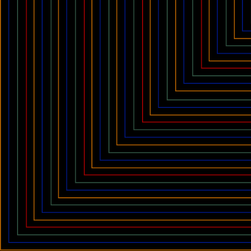

<!-- LS BADGES START -->

  
  
  
  
  

<!-- LS BADGES END -->

  

  

# producer’s almanac

## what this is
reusable decision logs (adrs), retros, and templates. clear and futureproofed.

## why it matters
- captures trade-offs so you don’t re-debate
- speeds up onboarding
- makes outcomes auditable

## try it in 5 minutes
1) open **/docs/SETUP.md**
2) create a new entry from **/docs/TEMPLATES/ADR.md**
3) link it to the related repo/issue and commit

## demo
- 60–90s clip: **/demo/producers-almanac-v0.mp4** *(placeholder)*

## includes
- **/docs/TEMPLATES/ADR.md** — decision log template
- **/docs/TEMPLATES/RETRO.md** — retro template
- **/docs/TEMPLATES/STATUS.md** — monthly status

## roadmap (next 4 weeks)
- [ ] wk1: templates + index
- [ ] wk2: tag system (area, risk, owner)
- [ ] wk3: “last 5 decisions” summary page
- [ ] wk4: export a printable packet

## status + links
- setup: **/docs/SETUP.md**
- index: **/docs/INDEX.md** *(placeholder)*
- license: **MIT**

---

  

  

